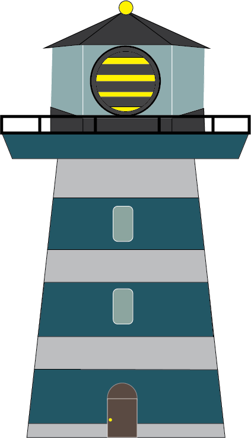

<!-- Improved compatibility of back to top link: See: https://github.com/othneildrew/Best-README-Template/pull/73 -->

<!-- PROJECT LOGO -->
 

  

<h3 align="center">Beecon</h3>

  

    The Spontaneous Gathering App
     
   
  

<!-- ABOUT THE PROJECT -->
## About The Project

 Beecon is a social app for spontaneous get-togethers. It was created to make it easier together at a moments notice.

Beecons are organized around activities both irl and virtual. Spark a Beecon to let others know you're interested in doing something and if critical mass is reached, the activity is a go! 

Take the anxiety out of big group texts, create more opportunities to see friends, turn whims into wins, and do more with Beecon today. Find Beecons for activities you're interested in and get notified when others are looking for people to do that activity with. 

Add spontaneity to your life or make the most of those sudden scraps of free time in your busy week! 

(<a href="#readme-top">back to top</a>)

### Built With

  
 
 
 

(<a href="#readme-top">back to top</a>)

<!-- GETTING STARTED -->
## Getting Started

Dowloand the latest version from the iOS app store or Google Play Store

### Prerequisites
iOS 12 or higher   OR   android 8 or higher

### Top contributors:

<!-- CONTACT -->
## Contact

Contact us at theBeeconApp@gmail.com

Project Link: [https://github.com/AlexanderTaliaferro/BeeconApp](https://github.com/AlexanderTaliaferro/BeeconApp)

Lead Designer: Alexander Kareem Taliaferro   [IG](https://www.instagram.com/kareemLeferro)

(<a href="#readme-top">back to top</a>)

(<a href="#readme-top">back to top</a>)

<!-- MARKDOWN LINKS & IMAGES -->
<!-- https://www.markdownguide.org/basic-syntax/#reference-style-links -->
[contributors-shield]: https://img.shields.io/github/contributors/AlexanderTaliaferro/BeeconApp.svg?style=for-the-badge
[contributors-url]: https://github.com/AlexanderTaliaferro/BeeconApp/graphs/contributors
[forks-shield]: https://img.shields.io/github/forks/AlexanderTaliaferro/BeeconApp.svg?style=for-the-badge
[forks-url]: https://github.com/AlexanderTaliaferro/BeeconApp/network/members
[stars-shield]: https://img.shields.io/github/stars/AlexanderTaliaferro/BeeconApp.svg?style=for-the-badge
[stars-url]: https://github.com/AlexanderTaliaferro/BeeconApp/stargazers
[issues-shield]: https://img.shields.io/github/issues/AlexanderTaliaferro/BeeconApp.svg?style=for-the-badge
[issues-url]: https://github.com/AlexanderTaliaferro/BeeconApp/issues
[license-shield]: https://img.shields.io/github/license/AlexanderTaliaferro/BeeconApp.svg?style=for-the-badge
[license-url]: https://github.com/AlexanderTaliaferro/BeeconApp/blob/master/LICENSE.txt
[linkedin-shield]: https://img.shields.io/badge/-LinkedIn-black.svg?style=for-the-badge&logo=linkedin&colorB=555
[linkedin-url]: https://linkedin.com/in/linkedin_username
[product-screenshot]: images/screenshot.png
[Next.js]: https://img.shields.io/badge/next.js-000000?style=for-the-badge&logo=nextdotjs&logoColor=white
[Next-url]: https://nextjs.org/
[React.js]: https://img.shields.io/badge/React-20232A?style=for-the-badge&logo=react&logoColor=61DAFB
[React-url]: https://reactjs.org/
[Vue.js]: https://img.shields.io/badge/Vue.js-35495E?style=for-the-badge&logo=vuedotjs&logoColor=4FC08D
[Vue-url]: https://vuejs.org/
[Angular.io]: https://img.shields.io/badge/Angular-DD0031?style=for-the-badge&logo=angular&logoColor=white
[Angular-url]: https://angular.io/
[Svelte.dev]: https://img.shields.io/badge/Svelte-4A4A55?style=for-the-badge&logo=svelte&logoColor=FF3E00
[Svelte-url]: https://svelte.dev/
[Laravel.com]: https://img.shields.io/badge/Laravel-FF2D20?style=for-the-badge&logo=laravel&logoColor=white
[Laravel-url]: https://laravel.com
[Bootstrap.com]: https://img.shields.io/badge/Bootstrap-563D7C?style=for-the-badge&logo=bootstrap&logoColor=white
[Bootstrap-url]: https://getbootstrap.com
[JQuery.com]: https://img.shields.io/badge/jQuery-0769AD?style=for-the-badge&logo=jquery&logoColor=white
[JQuery-url]: https://jquery.com 

